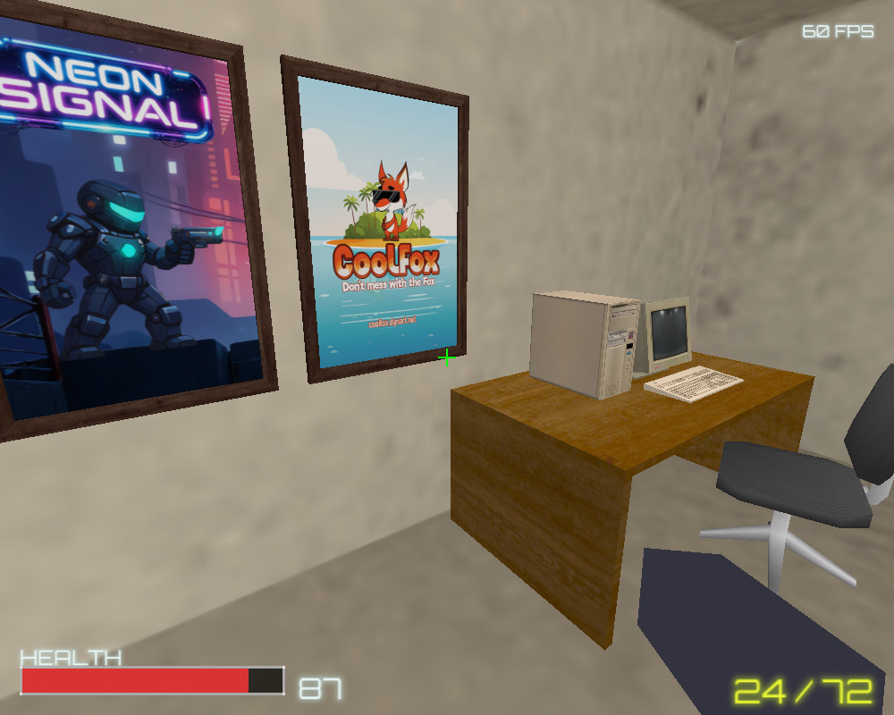

# SOOB Engine

A small FPS engine targeting everything from Windows 98 (Pentium 4, SDL 1.2, fixed-function OpenGL) through modern Linux and Windows. Bullet Physics, OpenAL Soft, header-only modules, no shaders.

The name is an acronym for the four foundation libraries the engine is built on: **S**DL + **O**penGL + **O**penAL + **B**ullet. (Working title was *SDLFun* — the binaries and the in-tree level still carry that name.)



## Depends on SOOB-Core

The 2D / audio / scripting core lives in a sibling repo, [**goph-R/SOOB-Core**](https://github.com/goph-R/SOOB-Core), and is shared with [goph-R/Find5](https://github.com/goph-R/Find5). Before building, clone it next to this one:

```
Win98/
├── SOOB-Engine/   ← this repo
├── SOOB-Core/     ← clone alongside
└── Find5/         ← optional, shares the same engine
```

```sh
git clone git@github.com:goph-R/SOOB-Core.git
```

Build scripts add `-I../SOOB-Core/` so `#include "script.h"` etc. resolve into the shared engine. Engine-side Lua modules (e.g. `engine.scene`) are copied next to the .exe at build time. SDLFun itself owns only the 3D-specific code (Bullet wrapper, `obj_loader.h`, `iqm.h`, `entity.h`, `physics.h`, `nav.h`, `flashlight.h`, `game.h`, `console.h`).

## Building

See `CLAUDE.md` for the full build matrix and toolchain details.

Quick reference:
- **Linux**: `make` (needs `libsdl1.2-dev`, `libopenal-dev`) → `sdlfun`
- **Windows 98 / Dev-C++**: `build.bat` → `SDLFun.exe`
- **Windows 10 / portable MinGW**: `build_win10.bat` → `SDLFun_w10.exe`
- **CMake**: `mkdir build && cd build && cmake .. && make`

## Menu + scripting

The main menu, options screen, and confirm dialogs are written in Lua on top of SOOB-Core's `engine.scene` scene-stack module — see `scripts/main.lua` and `scripts/menu.lua`. The C side keeps `AppState` + a one-shot `pendingAction`; menu code calls `app_new_game()` / `app_continue()` / `app_quit()` bindings (declared in `app_ext.h`) to drive game-state transitions.

The same pattern is intended for in-game mini-games (PIN-code panels, hacking puzzles, terminal interfaces): each becomes a Lua module that returns a scene factory, pushed on top of the 3D game while the simulation pauses. Architecture sketch in [`docs/add-mini-game.md`](docs/add-mini-game.md).

## Controls

Boot lands on the Lua main menu. Up/Down + Enter (or mouse) navigate the CONTINUE / NEW GAME / OPTIONS / EXIT buttons. The exit dialog uses Left/Right + Enter / Esc.

In-game: WASD move, mouse look, Space jump, F flashlight, Left-click fire, backtick (`) drops down the dev console (Lua REPL), Esc back to menu.

CLI flags: `-w <width>`, `-h <height>`, `-fullscreen`.

## Credits and licensing

### Code

The engine source code (everything under the repo except `vendor/`, `vendor_win10/`, and the assets called out below) is open source. Licenses for bundled third-party libraries:

| Library | License | Usage |
|---|---|---|
| SDL 1.2 | LGPL 2.1 | dynamically linked (`SDL.dll`) |
| OpenAL Soft | LGPL 2.1 | dynamically linked (`OpenAL32.dll`) |
| Bullet Physics | zlib | compiled from vendored source |

### Assets

All art, level, and texture assets in this repository are **© Dynart**, all rights reserved. This includes, but is not limited to:
- `assets/levels/test_level.obj` and its bakes (`diffuse.bmp`, `lightmap.bmp`)
- Everything under `assets/models/` and `assets/textures/` except the exceptions below
- Everything under `raw/` (Blender sources, GIMP sources, reference photos)

The following assets are **not** original and are bundled under their own terms:
- `assets/models/mrfixit.iqm`, `assets/textures/Head.tga`, `assets/textures/Body.tga` — from Lee Salzman's IQM sample pack. See the original IQM distribution for licensing.
- `assets/fonts/orbitron*.fnt` + `assets/fonts/orbitron*.tga` — BMFont bakes of Orbitron by Matt McInerney, licensed under the SIL Open Font License 1.1.
